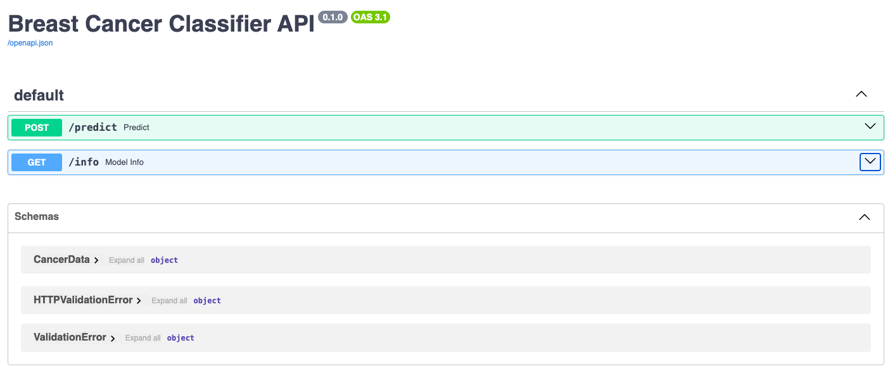

# Breast Cancer Prediction API with FastAPI

This project demonstrates how to serve a **machine learning model** as an API using **FastAPI**. The app uses a **Decision Tree Classifier** trained on a Breast Cancer dataset. Users can send feature data via HTTP requests and receive model predictions.

---

## Project Structure
```
mlops_labs
└── fastapi_lab1
    ├── assets/
    ├── fastapi_lab1_env/
    ├── model/
    │   └── breast_cancer.pkl
    ├── src/
    │   ├── __init__.py
    │   ├── main.py
    │   ├── predict.py
    │   └── train.py
    ├── README.md
    └── requirements.txt
```
Note:
 **fastapi[all]** in **requirements.txt** will install optional additional dependencies for fastapi which contains **uvicorn** too.

 ---

## Running the Lab

1. First step is to train a Decision Tree Classifier(Although you have **`model/iris_model.pkl`** when you cloned from the repo, let's create a new model). To do this, move into **src/** folder with
    ```bash
    cd src
    ```
2. To train the Decision Tree Classifier, run:
    ```bash
    python train.py
    ```
3. To serve the trained model as an API, run:
    ```bash
    uvicorn app:main --reload
    ```
4. Testing endpoints - to view the documentation of your api model you can use [http://127.0.0.1:8000/docs](http://127.0.0.1:8000/docs) (or) [http://localhost:8000/docs](http://localhost:8000/docs) after you run you run your FastAPI app.
    

   
You can also test out the results of your endpoints by interacting with them. Click on the dropdown button of your endpoint -> Try it out -> Fill the Request body -> Click on Execute button.


- You can also use other tools like [Postman](https://www.postman.com/) for API testing.
